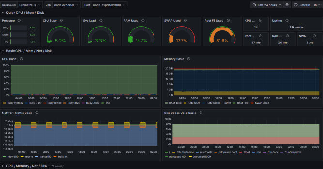

# Like CCTV, but for the server 📸🚨




This repository contains a base **Grafana** setup that uses **Loki** and **Prometheus** as datasources for visualization. Note that the current configuration is meant to be used on standalone _Linux_ server hosts and not in any sort of cluster node from management systems like Kubernetes or Docker Swarm.

We try to maintain the simplity of the configuration as much as possible seeing as we don't have any need for orchestration level workflows and monitoring.

**Loki** is a log aggregator, it's usually used with Promtail to get a log feed from running processes but since all our projects have containerization ennforced we simply use the [grafana/loki-docker-driver](https://hub.docker.com/r/grafana/loki-docker-driver) which does that for us with Docker containers.

**Prometheus** is a time series database, that in our case is used for monitoring system metrics. Much like **Loki** it needs a data feed, which is provided by the **node-exporter** service.

**Grafana** provides a web interface for visualizing the data from **Loki** and **Prometheus**. It also provides an alert system based on user rules that can act through SMTP, Webhooks, etc. This configurations comes **provisioned with two dashboards**, one for metrics and another for logs, complete with filters and graphs. There is also a **provisioned alert workflow** that sends an email through SMTP when the CPU, RAM or disk usage reach certain thresholds.

## Requirements 📋

- **Linux**
- Docker Compose 2.24.0+

## Usage 🚀

- Clone the repository and open a terminal **inside** it.

- Create a `.env` file based on the `.env.example` file.

- Install the [grafana/loki-docker-driver](https://hub.docker.com/r/grafana/loki-docker-driver) plugin:

  ```shell
  docker plugin install grafana/loki-docker-driver:3.2.1 --alias loki --grant-all-permissions
  docker plugin ls
  ```

- Change the default Docker logging driver in your host to the newly installed plugin in the respective `daemon.json` file:

  ```shell
  nano /etc/docker/daemon.json
  ```

  - Add the following content, replacing the `port` number with the one you set for **Loki** in the `.env` file:

    ```json
    {
        "debug" : true,
        "log-driver": "loki",
        "log-opts": {
            "loki-url": "http://localhost:port/loki/api/v1/push",
            "loki-batch-size": "400",
            "loki-retries": "3",
            "loki-max-backoff": "800ms",
            "loki-timeout": "3s"
        }
    }
    ```

- Restart to apply changes:

  ```shell
  systemctl restart docker
  ```

- Start the docker compose:

  ```shell
  docker compose up --force-recreate
  ```

- Access Grafana at the port you set in the `.env` file, the default login is  `admin / admin`, which you will then be prompted to forcibly change.

## Notes 📝

- To update the [grafana/loki-docker-driver](https://hub.docker.com/r/grafana/loki-docker-driver) driver plugin:

  ```shell
  docker plugin disable loki --force
  docker plugin upgrade loki grafana/loki-docker-driver:latest --grant-all-permissions
  docker plugin enable loki
  systemctl restart docker
  ```

- To update any of the docker services simply bump the versions in the `image` fields of the `docker-compose.yaml` file and run the `docker compose up --force-recreate` command to restart them.

- Always beware of **breaking changes** when updating to the latest versions! Look at the update notes of each component to see if there are any migration steps required when upgrading.
